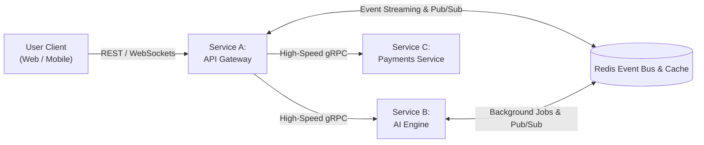
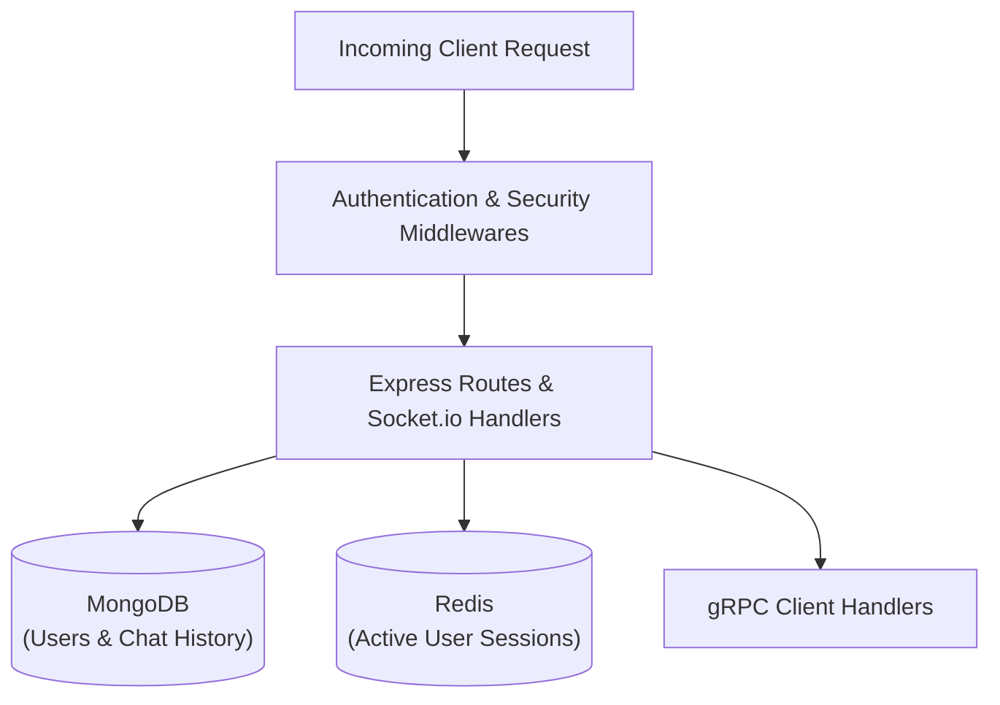
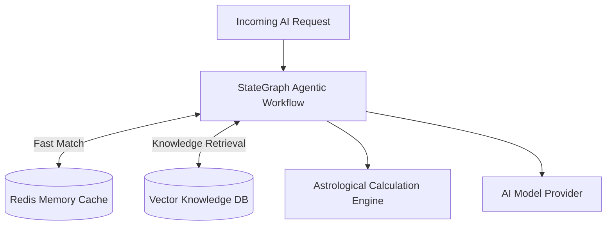
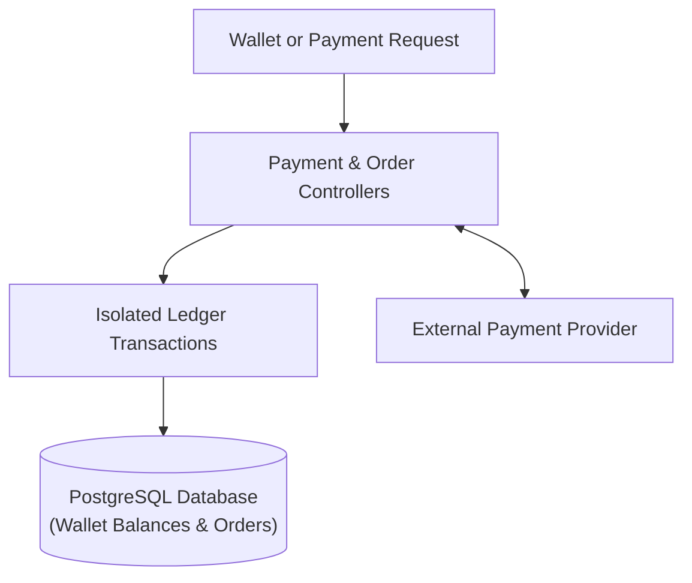
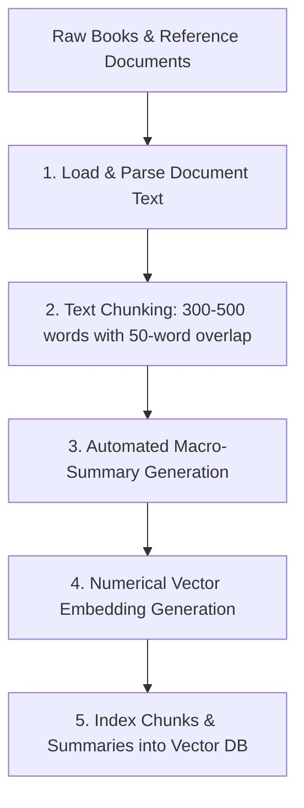
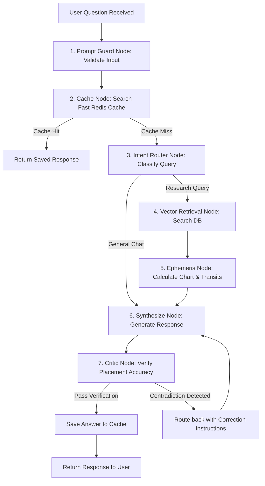

# Margyam v2 — Microservices AI 

Margyam AI v2 is a distributed microservices platform designed for real-time Astrology based AI advice, vector knowledge search, automated agentic workflow orchestration, and secure financial coin transactions. It is astrology ai product that calculate Kundli and Gochar and based on that generates personalized answer.

---

## High-Level System Architecture

The platform separates responsibilities into three independent microservices communicating through high-speed internal protocols.

### 1. Overall System Communication Topology



---

### 2. Service A: API Gateway & User Routing



---

### 3. Service B: AI Engine & Knowledge Architecture



---

### 4. Service C: Financial Commerce & Ledger Architecture



---

## Services Breakdown

| Service | Technology | Role | Communication & Storage |
| :--- | :--- | :--- | :--- |
| **`margyam-gateway`** | Node.js, Express, Socket.io | Manages user accounts, authentication, rate limiting, and real-time chat routing. | MongoDB, Redis, REST, WebSockets, gRPC |
| **`margyam-ai`** | Python, FastAPI, Celery | Handles question understanding, knowledge document ingestion, vector retrieval, chart calculation, and agent response synthesis. | Vector DB, Redis Cache, gRPC, Background Worker |
| **`margyam-payments`** | Node.js, Express, Prisma | Manages user coin wallets, payment processing, payouts, and daily account checks. | PostgreSQL Database, gRPC, REST |

---

## Data Ingestion & Knowledge Preparation Pipeline

The data ingestion pipeline processes raw books and reference documents offline to prepare them for knowledge search:



### Ingestion Pipeline Details
1. **Document Parsing**: Raw reference books, classical texts, and chapters are loaded into the processing pipeline.
2. **Text Chunking**: Long documents are split into smaller passages called chunks (300 to 500 words each). Adjacent chunks overlap by 50 words so that sentences split across boundaries do not lose context.
3. **Automated Summary Generation**: The pipeline automatically generates high-level summaries for whole chapters and books alongside individual passages. Saving macro summaries together with detailed micro chunks allows the search engine to match both broad high-level questions and specific detailed inquiries.
4. **Numerical Vector Embeddings**: Each text chunk and generated summary is converted into a numerical vector embedding, representing its underlying meaning mathematically.
5. **Vector Database Indexing**: Embeddings and metadata (book title, chapter number, chunk type, summary tag) are indexed in the vector database for high-speed similarity search.

---

## Agentic AI System Architecture

Runtime request processing is handled by an **agentic AI system** powered by a stateful graph workflow. Rather than running a static linear script, the AI engine operates as a network of autonomous worker nodes that collaborate, evaluate memory state, and self-heal outputs.



### Agentic Nodes & Workflow Components
1. **State Memory Management**: Passes a shared state object across all nodes. The state tracks user query, classified intent, calculated chart coordinates, retrieved book passages, cache hit status, model selection, and confidence score.
2. **Prompt Guard Agent Node**: Validates input text to filter out invalid queries or unauthorized injection attempts before execution starts.
3. **Cache Evaluation Agent Node**: Checks the fast memory cache for exact previous answers. If a match is found, execution skips further processing and returns immediately.
4. **Autonomous Intent Router Node**: Analyzes the question and decides the optimal execution path. Simple conversational greetings bypass heavy search nodes, while complex questions are routed to retrieval and calculation nodes.
5. **Knowledge Retrieval Agent Node**: Searches the vector database for matching passage chunks and chapter summaries based on reframed search parameters.
6. **Ephemeris Calculation Node**: Computes astronomical birth chart positions and real-time planetary transits for the active user.
7. **Response Synthesis Agent Node**: Combines retrieved knowledge, astronomical coordinates, and conversation history into a structured answer.
8. **Self-Healing Critic Agent Node**: Inspects the generated response against calculated birth chart data. If the AI model invents incorrect details (such as placing a planet in the wrong house), the critic node catches the contradiction and routes execution back to the synthesis node with corrective instructions (up to 2 retry attempts).

---

## Seamless Model Switching (Cloud API to Local Models)

The system is built with a decoupled model interface. The core application code is separated from the underlying AI provider.

### How Model Switching Works
- **Zero Application Code Changes**: Workflow logic, database storage, and API layers do not depend on any specific cloud vendor.
- **Single Point Configuration**: Model selection and provider routing are configured in a central settings file.
- **Switching to Self-Hosted Local Models**: To switch from cloud API-based models to local self-hosted models running on private servers, you only update the service URL or provider key in configuration.
- **Benefits**: Eliminates vendor lock-in, reduces hosting costs, and enables running completely offline or private AI models.

---

## Privacy & System Monitoring

The system includes built-in execution tracking to monitor health and response speeds.

- **Privacy Protection**: Sensitive user details are masked before logging trace information.
- **Performance Tracking**: Measures step-by-step execution times for database searches, chart calculations, and text generation.
- **Quality Feedback Loop**: Stores low-rated answers to automatically re-evaluate and improve future responses during off-peak hours.

---

## Financial Ledger & Wallet System

The payments service handles coin deductions and account balances securely.

- **Safe Coin Deductions**: Wallet balance changes take place inside isolated database transactions to prevent double deductions.
- **Internal Service Calls**: Communicates with the gateway using fast gRPC calls to check balances during live chat.
- **Daily Reconciliations**: Automatically checks payment provider records against internal database ledgers to verify every transaction.

---

## Directory Structure

```
margyam-v2/
├── margyam-gateway/         # Gateway service: User login, routing, and real-time chat
│   ├── src/
│   │   ├── controllers/     # Route handlers for auth, roles, and user data
│   │   ├── middlewares/     # Security and token validation
│   │   ├── sockets/         # Real-time chat connection handlers
│   │   ├── system/grpc/     # Service communication handlers
│   │   └── common/          # Shared helper modules
│   ├── app.js               # Service entrypoint
│   └── Dockerfile
│
├── margyam-ai/              # AI service: Question answering, ingestion, and chart calculations
│   ├── src/
│   │   ├── graph/           # Agentic state graph workflow nodes
│   │   ├── services/        # Document chunking and ingestion service
│   │   ├── system/grpc/     # Service communication handlers
│   │   ├── system/workers/  # Background guidance jobs
│   │   ├── utils/           # Database managers and AI client wrappers
│   │   └── common/          # Shared helper modules
│   ├── main.py              # Service entrypoint
│   └── Dockerfile
│
├── margyam-payments/         # Payments service: Wallets, orders, and payouts
│   ├── src/
│   │   ├── controllers/     # Wallet and transaction handlers
│   │   ├── services/        # Payment gateway business logic
│   │   ├── system/grpc/     # Service communication handlers
│   │   └── common/          # Shared helper modules
│   ├── app.js               # Service entrypoint
│   └── Dockerfile
│
├── docs/
│   └── migration/           # System design and architecture migration notes
│
├── docker-compose.yml       # Setup file to run all services together
└── README.md                # Main documentation file
```

---

## Security & Environment Configuration

Each service includes an `.env.sample` file listing required environment configuration variables. **Secret key files are ignored by default and are never saved to source control.**

### Setting Up Local Environment Files
Copy `.env.sample` in each service folder to create your local `.env` file:

```bash
# Gateway Service
cp margyam-gateway/.env.sample margyam-gateway/.env

# AI Service
cp margyam-ai/.env.sample margyam-ai/.env

# Payments Service
cp margyam-payments/.env.sample margyam-payments/.env
```

---

## How to Run the Project

### Option 1: Run All Services using Docker (Recommended)

Run all microservices along with database containers using a single command:

```bash
docker compose up --build
```

### Option 2: Run Services Individually

#### 1. Start Databases
Start local instances of MongoDB, PostgreSQL, Redis, and Vector DB.

#### 2. Start AI Service
```bash
cd margyam-ai
python3 -m venv venv
source venv/bin/activate
pip install -r requirements.txt
python main.py
```

#### 3. Start Payments Service
```bash
cd margyam-payments
npm install
npx prisma generate
npx prisma db push
npm run dev
```

#### 4. Start Gateway Service
```bash
cd margyam-gateway
npm install
npx prisma generate
npm run dev
```

---

## Automated Tests

Run unit and integration tests across each service:

```bash
# Gateway Service Tests
cd margyam-gateway && npm test

# Payments Service Tests
cd margyam-payments && npm test

# AI Service Tests
cd margyam-ai && PYTHONPATH=. venv/bin/pytest tests/
```

---

## License
This project is licensed under the MIT License.
